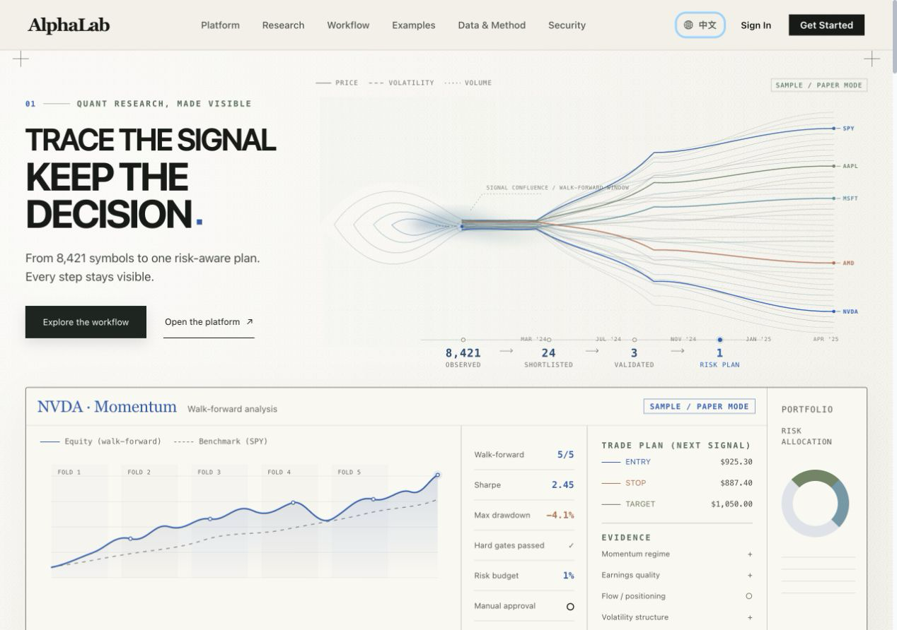

  

<h1 align="center">AlphaLab</h1>

  <strong>A self-hosted research-to-execution workspace for U.S. equities.</strong> 
  Screen markets, test ideas, review risk, build trade plans, and operate Alpaca paper or live accounts from one auditable workflow.

  
  
  
  
  

  <a href="#capabilities">Capabilities</a> ·
  <a href="#research-to-execution-workflow">Workflow</a> ·
  <a href="#architecture">Architecture</a> ·
  <a href="#quick-start">Quick start</a> ·
  <a href="#deployment">Deployment</a> ·
  <a href="#security-model">Security</a>

## Overview

AlphaLab v3.0.0 brings market research, strategy testing, portfolio-aware decision gates, and reviewed order execution into a single web application. The public site explains the product and methodology; the authenticated workspace contains the operational tools.

The platform is designed around visible evidence. Scanner inputs, validation results, blockers, order plans, and pipeline state remain inspectable instead of being hidden behind a single model score. AI providers can summarize evidence and challenge a decision, while deterministic code retains control of data-quality checks, portfolio admission, sizing, execution authorization, and hard risk stops.

The routed interface supports English and Simplified Chinese. New visitors start in English. An authenticated user's explicit language choice is saved with the workspace, restored across devices, and also controls supported Discord notification copy; local browser storage keeps switching usable while the backend is temporarily unavailable. Text returned by external providers may remain in its source language.

_AlphaLab v3 public overview in the English interface. Figures shown in this product illustration are not live telemetry._

## Capabilities

| Area | What is implemented |
| --- | --- |
| Market research | Market overview, Alpaca-backed U.S. equity scanning, configurable universes, symbol search, quotes, price history, news, technical context, and watchlists |
| Symbol analysis | Multi-timeframe charts, SMA 20/50, RSI 14, observed support and resistance, company context, and direct handoff into backtesting |
| Research pipeline | A shared manual and scheduled seven-stage pipeline with stage progress, blockers, candidate evidence, run results, and stop controls |
| Validation and risk | Fine Scan evidence gates, cost- and risk-aware Deeper Validation, chronological walk-forward checks, portfolio admission, quote freshness, capacity, and duplicate-position/order checks |
| Strategy lab | Twelve backtest engines including a buy-and-hold benchmark, return/risk/trade metrics, equity and drawdown charts, trade records, exhaustive parameter-grid sweeps, comparison, and ranking |
| Trade planning | Trigger conditions, entry zones, sizing, stop and target geometry, order previews, and explicit paper/live authorization checks |
| Brokerage | Alpaca paper and live account views, positions, orders, assets, portfolio history, reviewed order entry, cancellation, and managed position protection |
| Portfolio evidence | Exposure, concentration, cash weight, drawdown, unrealized P/L, source freshness, holdings CSV export, and a versioned portfolio JSON report |
| Operations and safety | Activity log, runtime and configuration health, Safety Center controls, readiness checks, order and notification histories, scheduled-run state, pipeline diagnostics, and optional bilingual Discord notifications |
| Evidence and saved artifacts | Read-only candidate evidence drawers with sensitive-field redaction and JSON export, plus cross-device scanner settings, watchlists, and saved strategy blueprints |
| Configuration and identity | Per-user Alpaca, market-data, AI-provider, Finnhub, and Discord settings; persistent workspace mode and language; secure email password recovery; Supabase TOTP MFA enrollment and challenge flows |

Data freshness and availability depend on the connected vendor, account entitlements, market hours, and rate limits. AlphaLab reports missing or stale inputs where the integration exposes that state; it does not make every feed real-time.

## Research-to-execution workflow

Manual runs and scheduled headless runs use the same backend stage contract:

~~~mermaid
flowchart LR
    A["1. Market Scanner"] --> B["2. Fine Scan"]
    B --> C["3. Deeper Validation"]
    C --> D["4. Portfolio Admission"]
    D --> E["5. Entry Plan"]
    E --> F["6. Execution"]
    F --> G["7. Position & Exit"]
~~~

1. **Market Scanner** ranks a configurable U.S. equity universe using market, liquidity, momentum, volatility, and data-quality evidence.
2. **Fine Scan** evaluates setup fit, confirmation, liquidity, news, and risk. AI may challenge or downgrade a candidate, but it cannot promote a deterministic failure.
3. **Deeper Validation** tests suitable strategies against costs, drawdown, benchmark performance, sample strength, parameter stability, and chronological walk-forward folds.
4. **Portfolio Admission** checks current positions, open orders, capacity, drift, strategy consistency, and account-level conflicts before a candidate can advance.
5. **Entry Plan** creates executable price geometry, sizing, triggers, invalidation, stops, targets, and an order preview from current evidence.
6. **Execution** applies deterministic quote, market, account, order, and authorization checks. AI does not own order submission policy.
7. **Position & Exit** reconciles managed plans, protective orders, hard stops, targets, and event/thesis review after entry.

### Operating modes

| Mode | Behavior |
| --- | --- |
| Manual | Runs deterministic research and planning; no automatic order submission |
| Hybrid | Adds AI review and challenge; no automatic order submission |
| Full AI | May submit an eligible order only after deterministic gates and explicit execution authorization |

New accounts begin in paper mode. After a user explicitly chooses paper or live mode, that account-scoped preference is restored on later sign-ins and other devices instead of being reset by authentication changes. Live mode remains separate, requires valid live credentials, and unattended live execution additionally requires an explicit persisted opt-in.

## Architecture

~~~mermaid
flowchart TB
    user["Browser"]

    subgraph web["React 18 frontend"]
        public["Public product and account pages"]
        workspace["Authenticated research workspace"]
        client["Typed REST client"]
    end

    subgraph core["Python 3.11 backend"]
        api["Flask JSON REST API"]
        pipeline["Seven-stage pipeline"]
        scheduler["In-process market scheduler"]
        guard["Position and exit guard"]
    end

    auth["Supabase Auth"]
    db["Supabase Postgres RLS configs, operations, artifacts, and run history"]
    market["Market data and news Alpaca · Finnhub"]
    broker["Alpaca brokerage paper · live"]
    ai["Configurable AI providers DeepSeek · OpenAI · Claude · Gemini · NVIDIA NIM"]
    discord["Discord webhooks"]

    user --> public
    user --> workspace
    public --> auth
    workspace --> auth
    workspace --> client
    client -->|"Supabase bearer token"| api
    api --> pipeline
    scheduler --> pipeline
    pipeline --> guard
    api --> db
    pipeline --> market
    pipeline --> broker
    pipeline --> ai
    pipeline --> discord
~~~

The backend currently owns the REST API, scheduler, and managed-position guard. Keep exactly one Gunicorn worker in production; running multiple workers or replicas can create multiple schedulers because there is no distributed scheduler lock. Route-level React code splitting keeps public and authenticated pages out of the initial route bundle until they are needed. A bilingual top-level error boundary provides a recovery path for render failures, and optional privacy-minimized Web Vitals events can be enabled for a host application's telemetry collector.

| Layer | Technology |
| --- | --- |
| Frontend | React 18.2, TypeScript 4.9, Create React App 5, React Router 6, Ant Design 5, Redux Toolkit, Axios |
| Visualization | Recharts, Ant Design Plots, Lightweight Charts |
| Backend | Python 3.11, Flask, Flask-CORS, Gunicorn, Pandas, NumPy |
| Identity and storage | Supabase Auth and Postgres with row-level security |
| Integrations | Alpaca, Finnhub, configurable AI providers, Discord |
| Delivery | Cloudflare Pages + Render, or a single Docker image with Nginx |
| Tests | Pytest, Jest through React Scripts, and Playwright smoke tests |

## Routes and modules

### Primary UI routes

| Workspace area | Routes | Purpose |
| --- | --- | --- |
| Public | <code>/</code>, <code>/platform</code>, <code>/workflow</code>, <code>/research</code>, <code>/examples</code>, <code>/data</code>, <code>/technology</code>, <code>/security</code>, <code>/about</code> | Product, methodology, examples, architecture, security, and project information |
| Account and legal | <code>/signin</code>, <code>/signup</code>, <code>/forgot-password</code>, <code>/reset-password</code>, <code>/mfa</code>, <code>/terms</code>, <code>/privacy</code> | Supabase-backed account, TOTP MFA, and legal flows |
| Overview | <code>/dashboard</code>, <code>/activity</code>, <code>/system-health</code> | Market overview, activity, configuration state, and runtime health |
| Markets | <code>/market</code>, <code>/market/symbol/:symbol</code>, <code>/watchlist</code> | Scanner, symbol research, and saved market lists |
| Research | <code>/agent</code>, <code>/agent/candidates</code>, <code>/agent/review</code> | Pipeline control plus read-only candidate and review workspaces |
| Strategies | <code>/backtest</code>, <code>/backtest/:id</code>, <code>/compare</code>, <code>/optimize</code>, <code>/ranking</code> | Backtests, details, parameter grids, comparison, and ranking |
| Trade | <code>/trade</code>, <code>/portfolio</code> | Reviewed orders, account state, positions, and portfolio history |
| Settings and safety | <code>/settings</code>, <code>/settings/configuration</code>, <code>/safety</code> | Preferences, MFA enrollment, external-service connections, readiness, entry pause/resume, order lifecycle, and delivery history |

### Backend API modules

| Prefix | Responsibility |
| --- | --- |
| <code>/api/health</code>, <code>/api/status</code> | Health and platform status |
| <code>/api/config/*</code>, <code>/api/settings/*</code> | Per-user provider and broker configuration |
| <code>/api/market/*</code> | Search, quotes, bars, news, user symbols, and scanning |
| <code>/api/backtest/*</code> | Backtests, history, and parameter-grid optimization |
| <code>/api/ai/*</code>, <code>/api/ai-agent/*</code> | AI analysis, staged research, scheduler control, results, and history |
| <code>/api/entry-plan/*</code>, <code>/api/trading/*</code> | Entry-plan checks, account data, reviewed orders, and cancellation |
| <code>/api/operations/*</code> | Durable Safety Center state, readiness, audit events, order lifecycle, notification delivery, and cross-device artifacts |
| <code>/api/notifications/*</code> | Discord configuration, testing, and event delivery |

The API is JSON/REST only. The repository does not currently include an OpenAPI specification or a WebSocket server.

## Quick start

### Prerequisites

- Git
- Node.js 20 or newer and npm
- Python 3.11
- A Supabase project for authentication and persistent pipeline configuration

Alpaca, Finnhub, AI-provider, and Discord credentials are optional at boot. Add the integrations you need from **Settings → Connections** after signing in. Market research and brokerage features remain unavailable until their required providers are configured.

### 1. Clone the repository

~~~bash
git clone https://github.com/Danielchen0101/Alpha_lab.git
cd Alpha_lab
~~~

### 2. Prepare Supabase

Create a Supabase project, enable the authentication providers you intend to use, then apply these SQL files in order in the Supabase SQL Editor:

1. <code>backend/supabase_schema.sql</code> for encrypted provider configuration, workspace preferences, pipeline schedules, and run history;
2. <code>backend/supabase_operations_store.sql</code> for Safety Center state, readiness, append-only operational records, order and notification history, and cross-device artifacts;
3. <code>backend/supabase_security_hardening.sql</code> to make browser roles read-only and keep all validated mutations behind the backend.

All three SQL files are required in production. Real new-entry paths fail closed when durable operations storage cannot be read, and the Safety Center and artifact APIs return an unavailable response instead of silently switching to process-local files. Local operations fallback is limited to development and test environments.

Collect:

- the project URL;
- the browser-safe anonymous key;
- the server-only service-role key.

### 3. Configure and start the backend

~~~bash
cd backend
python3 -m venv .venv
source .venv/bin/activate
# Windows PowerShell: .\.venv\Scripts\Activate.ps1

python -m pip install -r requirements.txt
cp .env.example .env
~~~

Set at least these values in <code>backend/.env</code>:

~~~dotenv
SUPABASE_URL=https://your-project.supabase.co
SUPABASE_SERVICE_ROLE_KEY=your-server-only-service-role-key
FERNET_KEY=your-stable-fernet-key
FRONTEND_ORIGIN=http://localhost:3000
FLASK_ENV=development
~~~

Generate a Fernet key once and keep the same value across deployments:

~~~bash
python -c "from cryptography.fernet import Fernet; print(Fernet.generate_key().decode())"
~~~

Start the development API:

~~~bash
python start_quant_backend.py
~~~

The local backend listens on <code>http://127.0.0.1:8889</code>. Verify it from another terminal:

~~~bash
curl http://127.0.0.1:8889/api/health
# {"status":"ok"}
~~~

### 4. Configure and start the frontend

~~~bash
cd ../frontend
npm ci
cp .env.example .env
~~~

Set these values in <code>frontend/.env</code>:

~~~dotenv
REACT_APP_API_BASE_URL=/api
REACT_APP_SUPABASE_URL=https://your-project.supabase.co
REACT_APP_SUPABASE_ANON_KEY=your-browser-safe-anon-key
REACT_APP_TURNSTILE_SITE_KEY=
~~~

The local React proxy sends <code>/api</code> requests to port 8889. Turnstile can remain empty during development; production sign-in, sign-up, and account recovery require a valid site key.

~~~bash
npm start
~~~

Open <code>http://localhost:3000</code>, create or sign in to an account, and add provider credentials under **Settings → Connections**. Begin with an Alpaca paper account.

## Environment variables

Every <code>REACT_APP_*</code> value is embedded into the browser build and must be treated as public. Never place a Supabase service-role key, Fernet key, broker secret, or AI secret in a frontend variable.

### Frontend build variables

| Variable | Required | Purpose |
| --- | --- | --- |
| <code>REACT_APP_API_BASE_URL</code> | Production | Canonical backend API base; use <code>/api</code> for the local proxy or same-origin Docker deployment |
| <code>REACT_APP_SUPABASE_URL</code> | Yes | Supabase project URL used by browser authentication |
| <code>REACT_APP_SUPABASE_ANON_KEY</code> | Yes | Browser-safe Supabase anonymous key |
| <code>REACT_APP_TURNSTILE_SITE_KEY</code> | Production auth | Public Cloudflare Turnstile site key |
| <code>REACT_APP_ENABLE_ANALYTICS</code> | No | Set to <code>true</code> to emit sanitized <code>alphalab:web-vital</code> browser events for a host telemetry collector |

### Backend runtime variables

| Variable | Required | Purpose |
| --- | --- | --- |
| <code>SUPABASE_URL</code> | Yes | Supabase project used for token verification and durable state |
| <code>SUPABASE_SERVICE_ROLE_KEY</code> | Yes | Server-only database key; never expose it to React |
| <code>FERNET_KEY</code> | Yes in persistent environments | Encrypts saved Alpaca, AI, Finnhub, and Discord fields; it must remain stable |
| <code>APP_SECRET_KEY</code> | Production | Stable Flask session and application signing secret |
| <code>FRONTEND_ORIGIN</code> | One origin | Allowed browser origin |
| <code>CORS_ORIGINS</code> | Multiple origins | Comma-separated alternative to <code>FRONTEND_ORIGIN</code> |
| <code>FLASK_ENV</code> | Production | Set to <code>production</code> outside local development |
| <code>PORT</code> | Hosted Gunicorn | Port supplied by Render or another process manager; the local entry point remains on 8889 |
| <code>FLASK_DEBUG</code> | No | Enables Flask debug behavior for local development |
| <code>DEBUG_ENDPOINTS</code> | No | Enables diagnostic endpoints only when <code>FLASK_ENV=development</code> |
| <code>OPERATIONS_STORE_LOCAL_FALLBACK</code> | Development only | Allows the local JSON operations mirror outside tests; never enable it on a hosted production service |

Authenticated broker and provider workflows use the per-user values saved from the Settings UI. They do not intentionally fall back to shared server-wide trading credentials.

## Deployment

AlphaLab supports a split web/API deployment and an all-in-one container.

### Cloudflare Pages + Render

| Service | Setting | Value |
| --- | --- | --- |
| Cloudflare Pages | Root directory | <code>frontend</code> |
| Cloudflare Pages | Build command | <code>npm ci && npm run build</code> |
| Cloudflare Pages | Output directory | <code>build</code> |
| Render | Root directory | <code>backend</code> |
| Render | Build command | <code>pip install -r requirements.txt</code> |
| Render | Start command | <code>MALLOC_ARENA_MAX=2 gunicorn start_quant_backend:app --bind 0.0.0.0:$PORT --workers 1 --threads 4 --timeout 900</code> |

Apply all three Supabase SQL files before deploying the application. Set the frontend build variables in Cloudflare Pages and the backend runtime variables in Render. Point <code>REACT_APP_API_BASE_URL</code> to the Render service with the <code>/api</code> suffix, and set <code>FRONTEND_ORIGIN</code> to the exact deployed frontend origin.

Add the deployed frontend origin and its <code>/auth/confirmed</code> and <code>/reset-password</code> callbacks to the Supabase Auth URL configuration. Configure the same production host for Turnstile.

The scheduler, position guard, and order reconciliation run inside the backend process. Unattended operation therefore requires an always-on instance. A sleeping instance stops those tasks until the service wakes again. Pausing new entries in the Safety Center preserves broker-side protective sell, stop, and OCO orders; it does not make the in-process guard independent of backend availability.

### Docker

The root Dockerfile builds the React frontend with Node 20, installs the Python 3.11 backend, runs one Gunicorn worker, and serves the application through Nginx on port 8080.

~~~bash
docker build \
  --build-arg REACT_APP_API_BASE_URL=/api \
  --build-arg REACT_APP_SUPABASE_URL=https://your-project.supabase.co \
  --build-arg REACT_APP_SUPABASE_ANON_KEY=your-browser-safe-anon-key \
  --build-arg REACT_APP_TURNSTILE_SITE_KEY=your-public-site-key \
  -t alphalab:v3.0.0 .

docker run --rm \
  --env-file backend/.env \
  -p 8080:8080 \
  alphalab:v3.0.0
~~~

Open <code>http://localhost:8080</code> and check <code>http://localhost:8080/api/health</code>. Frontend build arguments are public; backend secrets belong only in the runtime environment.

See [DEPLOYMENT.md](DEPLOYMENT.md) for the hosting checklist. Deployment configuration is currently managed in provider dashboards rather than repository-owned Render or Cloudflare configuration files.

## Testing

### Backend

~~~bash
cd backend
python -m pytest -v
~~~

The backend test suite covers authentication behavior, scanner and validation gates, admission, entry execution, pipeline contracts and runtime state, position protection, and deployment invariants.

### Frontend

~~~bash
cd frontend

npm test -- --watchAll=false
npx eslint src/ --ext .js,.jsx,.ts,.tsx
npx tsc --noEmit
npm run build
~~~

Playwright builds and serves the production frontend locally at <code>http://127.0.0.1:4173</code> by default. Set <code>PLAYWRIGHT_BASE_URL</code> only when intentionally testing an external deployment:

~~~bash
npm run test:e2e
PLAYWRIGHT_BASE_URL=https://www.alphalabquant.com npm run test:e2e
~~~

The current validation baseline is **64 frontend Jest tests, 293 backend pytest tests, and 12 Chromium Playwright tests**. CI also runs production builds, TypeScript and ESLint checks, high/critical npm dependency gating, Python dependency auditing, secret scanning, and Docker validation. Create React App remains a legacy toolchain, but the documentation does not pin audit or bundle-size counts that can become stale after each lockfile update.

These checks do not prove market-data quality, strategy validity, broker availability, deployment availability, or future trading performance. Verify every configured environment separately.

## Security model

- **Supabase sessions:** the browser obtains a Supabase session and sends its bearer token with authenticated workspace requests.
- **Owner-scoped storage:** the supplied SQL enables row-level security for provider configuration, pipeline configuration, and run history. Backend service-role queries are scoped to the verified user.
- **Durable operations state:** the operations migration adds versioned Safety Center state, readiness, lifecycle and delivery records, and owner-scoped artifacts. Production real-entry checks fail closed if this store is unavailable.
- **Server-side secrets:** <code>SUPABASE_SERVICE_ROLE_KEY</code> and <code>FERNET_KEY</code> stay on the backend. Browser builds receive only the Supabase anonymous key and other public build values.
- **Credential protection:** provider fields are encrypted before storage and masked on reads when a stable Fernet key and the cryptography dependency are present. Missing or rotating the key can make stored values unreadable.
- **Human verification:** Turnstile protects production sign-in, registration, and password-recovery flows when configured.
- **MFA:** users can enroll a TOTP authenticator in Settings; enrolled accounts are routed through an AAL2 challenge when the Supabase session requires it.
- **Account-scoped trading mode:** new accounts start in paper mode, while an explicit paper/live choice is saved and restored across sessions and devices. Live and unattended execution still require separate authorization.
- **Safety semantics:** pausing new entries can optionally cancel pending managed buys while retaining protective exits; resuming uses optimistic version checks against durable state.
- **Bounded AI authority:** AI can summarize, challenge, or downgrade evidence; it cannot bypass deterministic data, capacity, duplicate-order, execution, or hard-stop controls.

The Flask application retains legacy compatibility routes, and its built-in rate limiting is process-local rather than a distributed WAF. Review exposed routes, use HTTPS, restrict CORS to exact origins, place production deployments behind appropriate edge controls, and rotate any credential that may have been exposed.

To report a vulnerability, follow [SECURITY.md](SECURITY.md). Avoid posting credentials, account data, or exploit details in a public issue; use GitHub private vulnerability reporting when it is available.

## Trading and model risk

> **AlphaLab is research and execution software, not investment advice. Trading can result in partial or total loss.**

- Start with paper trading and independently inspect every stage output before enabling live execution.
- Backtests and parameter sweeps are simplified research tools. Historical results, model scores, and walk-forward checks do not predict future performance.
- Quotes, bars, news, calendars, and broker state can be delayed, incomplete, stale, rate-limited, or unavailable.
- AI output can be incorrect or inconsistent. Deterministic gates reduce some failure modes but cannot eliminate market, model, software, or operational risk.
- The scheduler is process-local. A crash, deploy, network outage, or sleeping host stops scheduled work and position monitoring until the backend resumes.
- Use broker-side protective orders where appropriate, maintain independent account monitoring, set conservative permissions and limits, and keep a manual kill path.

You are responsible for provider agreements, market-data licensing, regulatory obligations, tax treatment, order review, and every trading decision made with the software.

## Contributing

Issues and pull requests are welcome.

1. Read [CONTRIBUTING.md](CONTRIBUTING.md) and [COMMIT_CONVENTION.md](COMMIT_CONVENTION.md).
2. Create a focused branch and keep unrelated generated, credential, runtime, and build files out of the change.
3. Add or update tests for behavior changes.
4. Run the relevant backend and frontend checks above.
5. Open a pull request that explains the change, risk, validation, and any migration steps. Include screenshots for visible UI changes.

Please use Conventional Commit subjects such as <code>feat(market): add a scanner filter</code> or <code>fix(pipeline): preserve a hard risk gate</code>.

## License

AlphaLab is available under the [MIT License](LICENSE).
